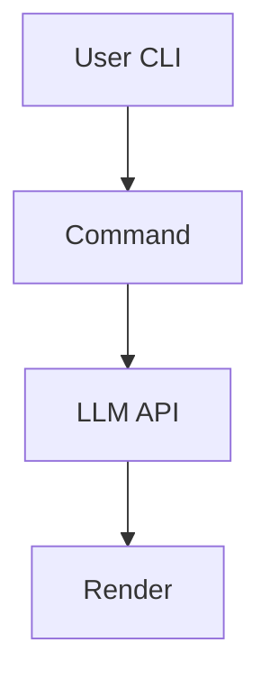

# ai-chat

[](https://go.dev/doc/go1.24)
[](#ci--cd-pipeline-walk-through)
[](../LICENSE)
[](#release-process)

## Project Overview

A concise CLI for interacting with AI chat models with a strong security posture.

## Feature Matrix

- Interactive CLI with TUI
- Configuration management
- Embedding and summarization via AI ops
- SBOM generation and signed releases
- Windows and Linux packaging

## Repository Layout

| Path | Purpose |
|------|---------|
| `cmd/` | CLI entry commands |
| `internal/` | private packages like shell detection and TUI |
| `pkg/` | public packages used by commands |
| `docs/` | documentation source |
| `.github/` | CI workflows |

## Architecture



## Security-by-Design

- Uses FIPS BoringCrypto enabled Go toolchain
- Scans dependencies with `gosec`, `govulncheck`, `trivy`, and `grype`
- Generates an SPDX SBOM and signs binaries with Cosign
- Optionally enforces nftables default-deny
- Caches build artefacts with integrity checks

## CI / CD Pipeline Walk-Through

The pipeline runs unit tests, merges coverage, enforces a 93% gate,
then runs security scanners before building and signing release artefacts.

## Quick-Start Usage

Install from GitHub Releases and run:

```bash
aio-chat-cli "hello"
```

## Building From Source

```bash
bash scripts/preflight-ci.sh
make build
```

## Release Process

Tag a commit. CI builds artefacts, generates an SBOM, signs with Cosign,
and publishes to GitHub and an OCI registry.

## Intelligent CI Skip

Commits that only modify documentation are detected automatically. A local
`prepare-commit-msg` hook appends `[skip ci]` to the message, and the
`pipeline-guard` job exits early so runners stay idle. Any code change runs the
full suite with a **93 %** coverage gate.
You can run the entire pipeline locally with `./scripts/gauntlet.sh`.

## Compliance Mapping

| NIST 800-53 Control | Implementation |
|--------------------|---------------|
| SI-2 | Automated vulnerability scanning via Trivy and Govulncheck |
| CM-5 | SBOM generation ensures component inventory |

## Contributing Guide

Create feature branches and open PRs. Run `make lint` and unit tests before pushing.

## Roadmap

- Improve multi-LLM support
- Add advanced TUI features

## License

SPDX-License-Identifier: MIT
